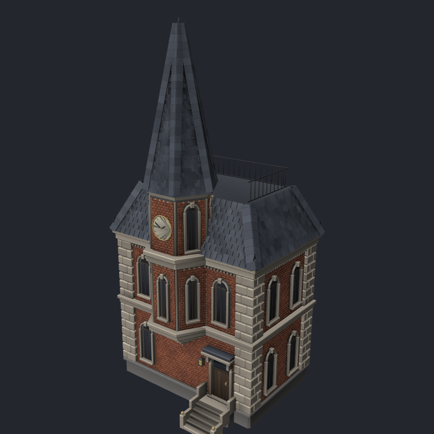
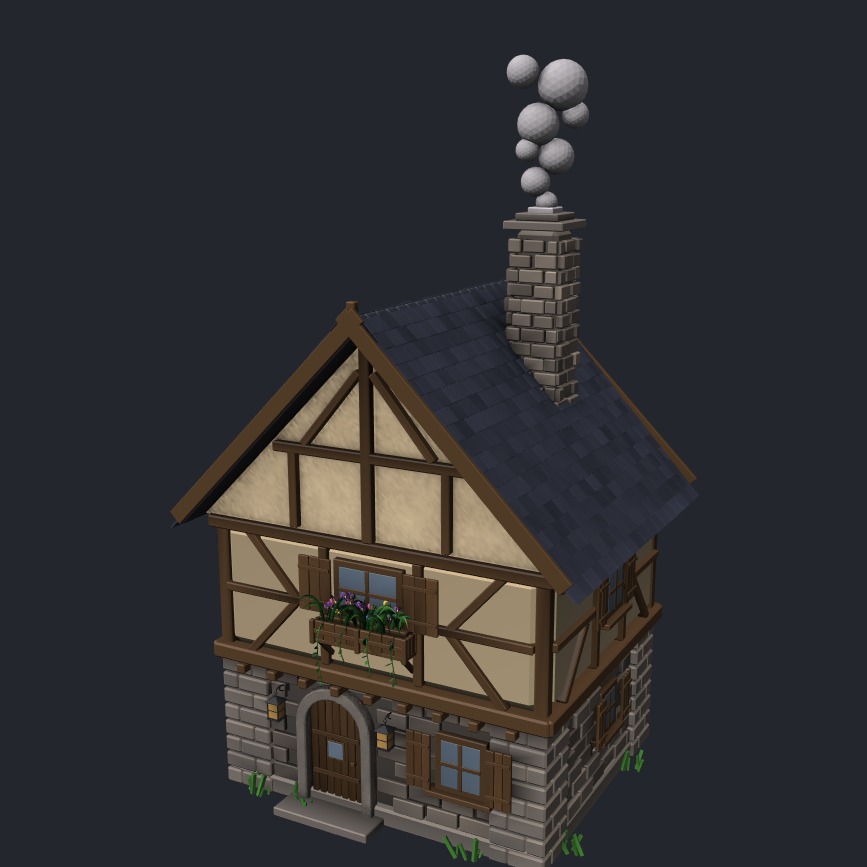
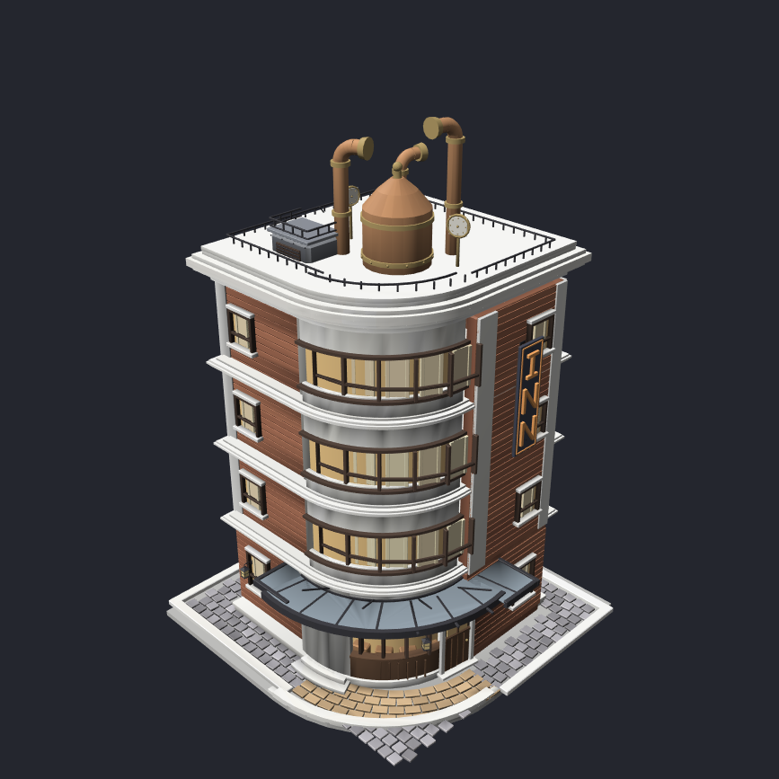
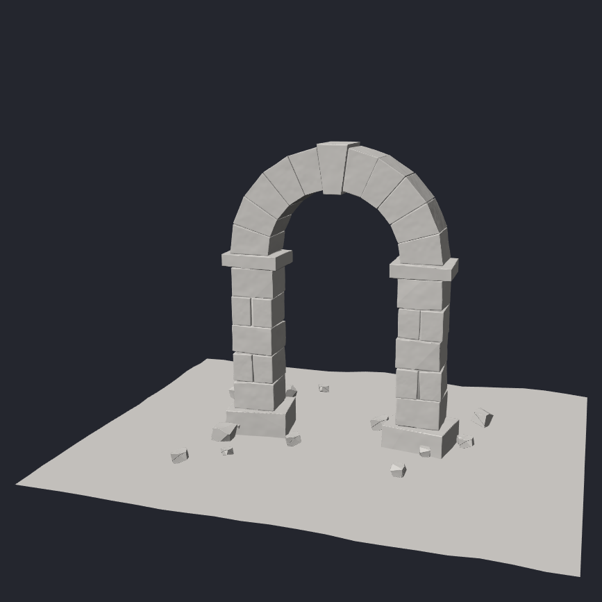

# PGG

PGG is a procedural geometry language: a text-first node graph for LLM agents, with a node projection for humans. This repository is the language, library, CLI, viewer, tests, and art examples.

| [Spire House](resources/AmberEstate/spire_house.pgg) | [Cottage](resources/AmberEstate/cottage.pgg) |
|---|---|
|  |  |
| [Inn Hotel](resources/pgg/inn_hotel.pgg) | [Stone Arch](resources/AmberEstate/stone_arch.pgg) |
|  |  |

How the shots were framed and how to regenerate them: [`docs/gallery/README.md`](docs/gallery/README.md).

| Path | What it is |
|---|---|
| `src/libs/pgg` | Library: parser (ANTLR4 4.13.2), AST, execution core |
| `src/apps/PggTool` | CLI: `check` / `fmt` / `ast` / `run` / `docs` / `diff` |
| `src/apps/PggViewer` | Node projection + geometry preview (no TCP) |
| `src/apps/PggServe` | Agent RPC daemon: slots by `.pgg` path, `:9878` |
| `src/tests/pgg` | gtest + `corpus/` fixtures and `goldens/` fingerprints |
| `resources/pgg` | Shared `lib/` and remaining art examples (inn_hotel, clocktower, …) |
| `resources/AmberEstate` | Estate mini-project: cottages, spire house, church, stone arch, props |
| `resources/Mansion` | Brick-style mansion built from photo references (`reference/`, `analysis.md`) |
| `docs/pgg` | Language spec, implementation notes, cheatsheet, RPC contract |
| `docs/gallery` | README hero shots of the art examples |

## Build

Build is CMake + vcpkg: submodule `toolchain/vcpkg`, presets in `CMakePresets.json`, overlay `vcpkg_overlays/ports`. The first configure bootstraps dependencies from `vcpkg.json`.

```sh
git submodule update --init toolchain/vcpkg
./build_linux.sh                          # cmake --preset linux
cmake --build --preset linux-debug --target pgg_tests
cmake --build --preset linux-debug --target PggTool
cmake --build --preset linux-debug --target PggViewer
cmake --build --preset linux-debug --target PggServe
ctest --test-dir _int_linux --output-on-failure
```

Windows: `generate_vs.bat` → `_intermediate_64\pgg.sln`, or `cmake --build --preset debug --target pgg_tests`.
macOS: `./build_mac.sh`, then `cmake --build --preset macos-debug --target pgg_tests`.

Binaries: `_int_linux/src/apps/<App>/Debug/<App>` (Ninja puts the exe under `$<CONFIG>`).

Platform notes, binary cache, and `compile_commands.json` — `docs/BUILD.md`.

After changing `src/libs/pgg/grammar/Pgg.g4`, run `tools/pgg/regen_parser.sh` (the generated parser is committed under `parser_gen/`).

## Tools

```sh
PggTool check resources/AmberEstate/cottage.pgg
PggTool docs builtins
PggViewer resources/AmberEstate/spire_house.pgg
PggServe                                  # RPC 127.0.0.1:9878
```

MCP server `pgg` — `.mcp.json` / `.cursor/mcp.json`, `python3 -m tools.pgg_mcp.launch`. Missing binary → `need_build` (`PggServe`). Contract: `docs/pgg/serve_rpc.md`. Env: `PGG_REPO_ROOT`, `PGG_SERVE`.

Agent instructions: `AGENTS.md`.
