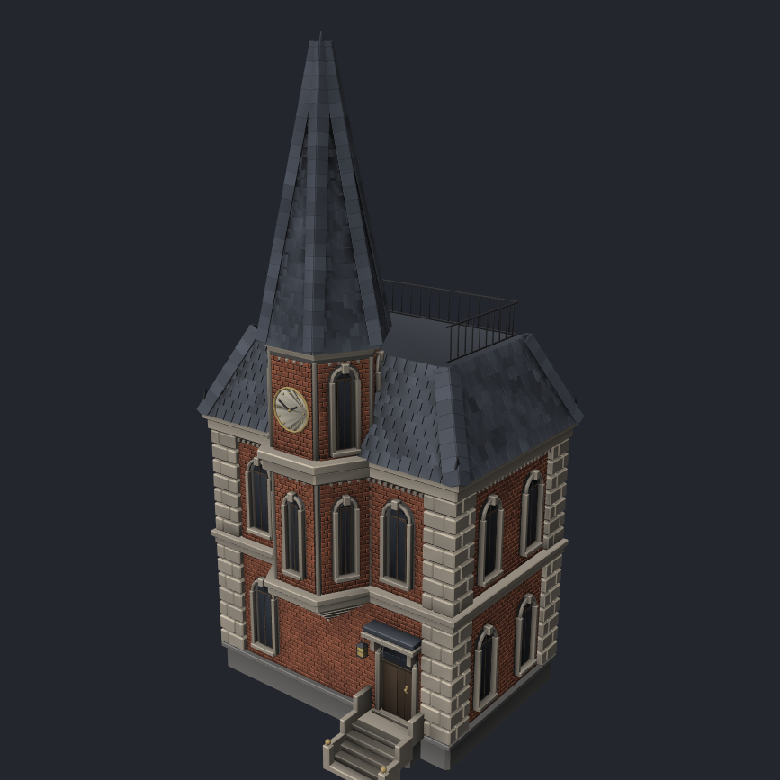
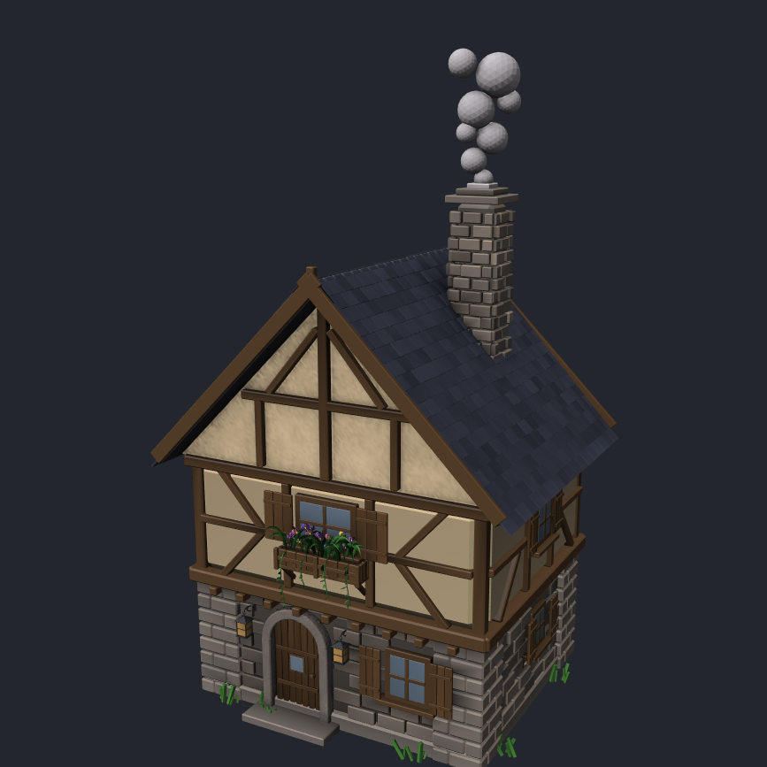
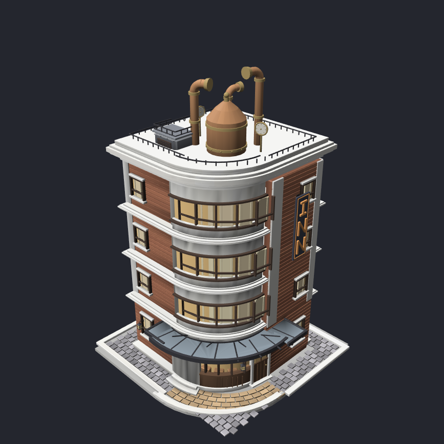
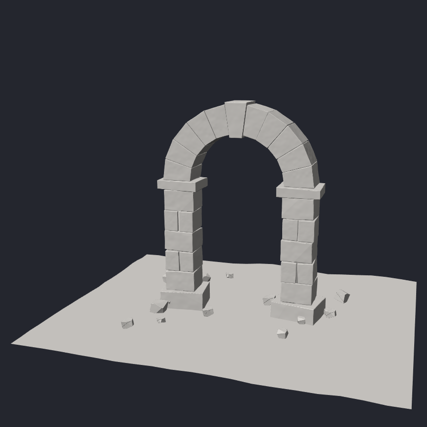

# PGG monorepo

**PGG** is a procedural geometry language: a text-first node graph for LLM agents, with a node projection for humans. This repository is the language, library, CLI, viewer, tests, and art examples — and the monorepo home of the projects built on it:

- **Delve** — a dungeon orchestrator on top of PGG (slot assets) and edgar (layout generation): project files, IR, fill, checks, OBJ export, viewer, CLI and RPC daemon. Docs: [`docs/delve`](docs/delve/requirements.md), demo projects under `projects/`.
- **level-synth / edgar** — a C++20 port of [Edgar-DotNet](https://github.com/OndrejNepozitek/Edgar-DotNet) graph-based 2D layout generation (`src/libs/edgar`), with an SDL3 + ImGui viewer (`src/apps/main`). Docs: [`docs/level-synth`](docs/level-synth/README.md).

| [Spire House](resources/AmberEstate/spire_house.pgg) | [Cottage](resources/AmberEstate/cottage.pgg) |
|---|---|
|  |  |
| [Inn Hotel](resources/pgg/inn_hotel.pgg) | [Stone Arch](resources/AmberEstate/stone_arch.pgg) |
|  |  |

How the shots were framed and how to regenerate them: [`docs/gallery/README.md`](docs/gallery/README.md).

| Path | What it is |
|---|---|
| `src/libs/pgg` | PGG library: parser (ANTLR4 4.13.2), AST, execution core |
| `src/libs/pgg_preview` | Headless preview capture used by delve and tooling |
| `src/libs/edgar` | Layout generation library (Edgar-DotNet port) |
| `src/libs/drui` | ImGui font/UI helpers for the level-synth viewer |
| `src/libs/delve*` | Delve pipeline: project/IR, layout, fill, check, export, d0 |
| `src/apps/PggTool` | PGG CLI: `check` / `fmt` / `ast` / `run` / `docs` / `diff` |
| `src/apps/PggViewer` | PGG node projection + geometry preview (no TCP) |
| `src/apps/PggServe` | PGG agent RPC daemon: slots by `.pgg` path, `:9878` |
| `src/apps/DelveViewer` | Delve layout/fill preview |
| `src/apps/DelveCli` | Delve machine loop: `validate` / `layout` / `fill` / `export` / `check` |
| `src/apps/DelveServe` | Delve RPC daemon: warm project slots |
| `src/apps/main` | level-synth SDL3 + ImGui viewer (legacy target name) |
| `src/tests` | gtest suites: `pgg/`, `delve_*_test.cpp`, edgar tests |
| `resources/pgg` | PGG shared `lib/` and art examples (inn_hotel, clocktower, …) |
| `resources/AmberEstate` | Estate mini-project: cottages, spire house, church, stone arch, props |
| `resources/Mansion` | Brick-style mansion built from photo references (`reference/`, `analysis.md`) |
| `resources/edgar_gui` | level-synth viewer data (MapDescriptions, Images, …) |
| `assets/` | Delve slot assets (rooms, walls, doors, decor, patterns) |
| `projects/` | Delve demo projects |
| `test_data/` | level-synth parity/preset fixtures |
| `docs/pgg` | PGG language spec, implementation notes, cheatsheet, RPC contract |
| `docs/delve` | Delve docs (requirements, pipeline, formats, MCP) |
| `docs/level-synth` | level-synth docs (port parity, presets, test matrix) |
| `docs/gallery` | README hero shots of the art examples |

## Build

Build is CMake + vcpkg: submodule `toolchain/vcpkg`, presets in `CMakePresets.json`, overlay `vcpkg_overlays/ports`. The first configure bootstraps dependencies from `vcpkg.json`.

```sh
git submodule update --init toolchain/vcpkg
./build_linux.sh                          # cmake --preset linux
cmake --build --preset linux-debug        # everything: pgg, delve, edgar
ctest --test-dir _int_linux --output-on-failure
```

Windows: `generate_vs.bat` → `_intermediate_64\pgg.sln`, or `cmake --build --preset debug`.
macOS: `./build_mac.sh`, then `cmake --build --preset macos-debug`.

Binaries: `_int_linux/src/apps/<App>/Debug/<App>` (Ninja puts the exe under `$<CONFIG>`).

Platform notes, binary cache, and `compile_commands.json` — `docs/BUILD.md`.

After changing `src/libs/pgg/grammar/Pgg.g4`, run `tools/pgg/regen_parser.sh` (the generated parser is committed under `parser_gen/`).

## Tools

```sh
PggTool check resources/AmberEstate/cottage.pgg
PggTool docs builtins
PggViewer resources/AmberEstate/spire_house.pgg
PggServe                                  # RPC 127.0.0.1:9878
DelveCli validate projects/demo/project.json
DelveCli export projects/iso/project.json -o tmp/iso_export
DelveViewer projects/demo/project.json
DelveServe                                # RPC daemon, warm project slots
```

MCP servers — `.mcp.json` / `.cursor/mcp.json`: `pgg` (`python3 -m tools.pgg_mcp.launch`) and `delve` (`python3 -m tools.delve_mcp.launch`). Missing binary → `need_build`. Contracts: `docs/pgg/serve_rpc.md`, `docs/delve/mcp_v1.md`. Env: `PGG_REPO_ROOT`, `PGG_SERVE`, `DELVE_REPO_ROOT`.

Agent instructions: `AGENTS.md`.
